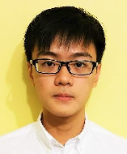
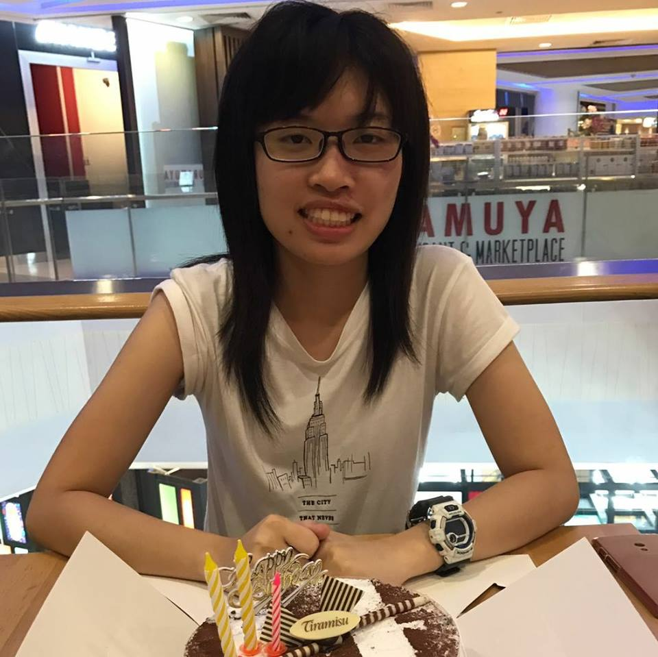
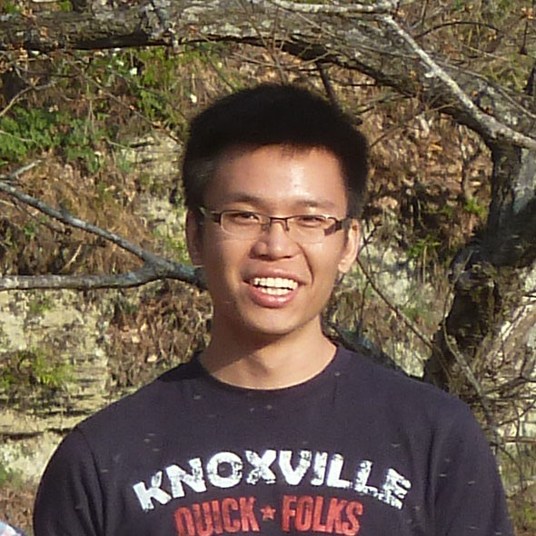
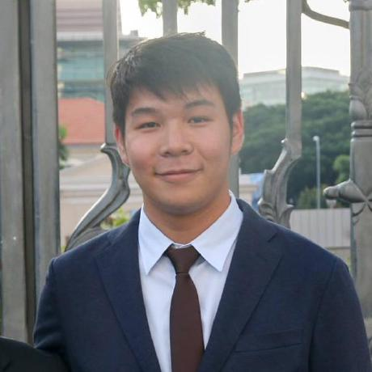
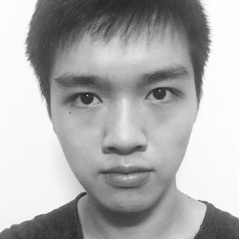
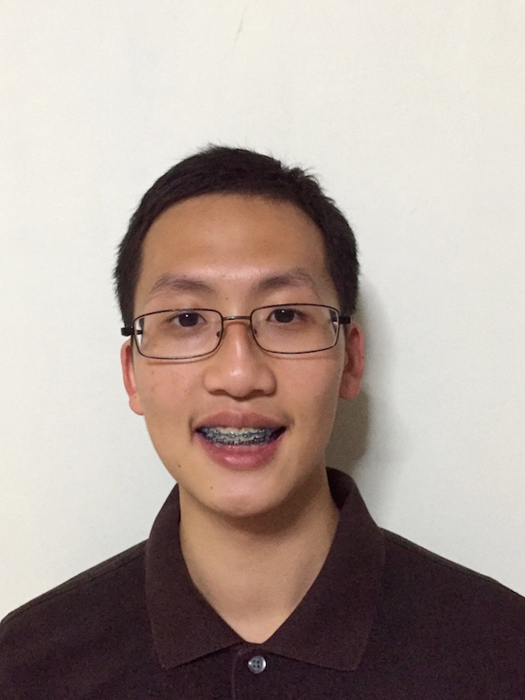
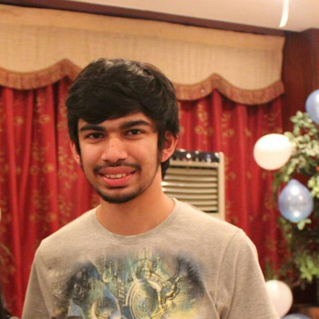
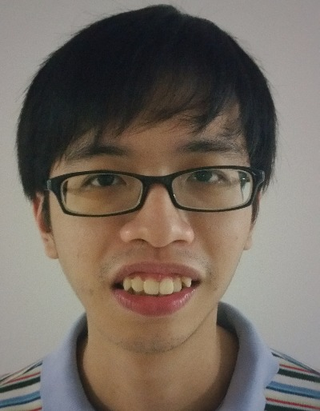

<!-- Example:

> ## John Doe
>  
> [[Resume](johnDoe/resume.md)]
> [[Website](http://www.jd.com)]
> [[Github](http://github.com/john-doe-123)]
> [[Progress](johnDoe/progress.md)]
>
> * Expert areas: JavaScript, Node.js, Website Performance
> * Projects: Node.js, TEAMMATES -->

------------------------------------------------
**MarkBind**:
* [CHUA YUN ZHI NICHOLAS](#chua-yun-zhi-nicholas)
* [DANIEL BERZIN CHUA YUAN SIANG](#daniel-berzin-chua-yuan-siang)
* [RACHAEL SIM HWEE LING](#rachael-sim-hwee-ling)

**PowerPointLabs**:
* [LEE YAN HWA](#lee-yan-hwa)
* [TAN JUN KIAT](#tan-jun-kiat)
* [ALEX FONG JIE WEN](#alex-fong-jie-wen)

**SE-EDU**:
* [KOH LEWIS](#koh-lewis)
* [TAN JUN AN](#tan-jun-an)
* [VIVEK LAKSHMANAN](#vivek-lakshmanan)
* [YONG ZHI YUAN](#yong-zhi-yuan)

**TEAMMATES**:
* [CARA LEONG SU-YI](#cara-leong-su-yi)
* [DARREN WEE ZHE YU](#darren-wee-zhe-yu)
* [JOANNE ONG CUI FANG](#joanne-ong-cui-fang)
* [LU LECHUAN](#lu-lechuan)
* [NGUYEN QUOC BAO](#nguyen-quoc-bao)
* [PAN HAOZHE](#pan-haozhe)
* [PHANG CHUN RONG](#phang-chun-rong)
* [SHRADHEYA THAKRE](#shradheya-thakre)
* [TAN LI HAO](#tan-li-hao)
* [TRAN TIEN DAT](#tran-tien-dat)
* [WEN XIN](#wen-xin)

# MarkBind

## CHUA YUN ZHI NICHOLAS

 
[[Resume](nicholasChua/nicholasChua-Resume.md)]
[[Website](https://nicholaschuayunzhi.github.io)]
[[Github](https://github.com/nicholaschuayunzhi)]
[[Progress](progress.md#chua-yun-zhi-nicholas)]

* Expert areas: JavaScript, Code Quality
* Projects: MarkBind

## DANIEL BERZIN CHUA YUAN SIANG

 
[[Resume](danielBerzinChua/danielBerzinChua-resume.md)]
[[Website](https://github.com/danielbrzn)]
[[Github](https://github.com/danielbrzn)]
[[Progress](progress.md#daniel-berzin-chua-yuan-siang)]

* Expert areas: Java, Node.js, Web Scraping
* Projects: MarkBind

## RACHAEL SIM HWEE LING

 
[[Resume](rachaelSim/rachaelSim-Resume.md)]
[[Website](https://github.com/rachx)]
[[Github](https://github.com/rachx)]
[[Progress](progress.md#rachael-sim-hwee-ling)]

* Expert areas: Swift, Node.js, Artificial Intelligence
* Projects: MarkBind

# PowerPointLabs

## LEE YAN HWA

 
[[Resume](leeYanHwa/leeYanHwa-Resume.md)]
[[Website](http://www.comp.nus.edu.sg/~yanhwa/)]
[[Github](https://github.com/leeyh20)]
[[Progress](progress.md#lee-yan-hwa)]

* Expert areas: Java, C#, Android App Development, Testing
* Projects: PowerPointLabs

## TAN JUN KIAT

 
[[Resume](https://github.com/nus-cs3281/2018/blob/master/students/tanJunKiat/tanJunKiat-Resume.md#tan-jun-kiat)]
[[Website](https://github.com/junkiattan)]
[[Github](https://github.com/junkiattan)]
[[Progress](progress.md#tan-jun-kiat)]

* Expert areas: C#, Java, UX Design, Documentation
* Projects: [PowerPointLabs](https://github.com/PowerPointLabs/PowerPointLabs), [TEAMMATES](https://github.com/TEAMMATES/teammates), [Wikimedia Commons](https://github.com/commons-app/apps-android-commons)

## ALEX FONG JIE WEN

 
[[Resume](alexFong/alexFong-Resume.md)]
[[Website](https://github.com/AlexFJW)]
[[Github](https://github.com/AlexFJW)]
[[Progress](progress.md#alex-fong-jie-wen)]

* Expert areas: Android, Kotlin, Deep Learning
* Projects: PowerPointLabs

# SE-EDU

## KOH LEWIS

 
[[Resume](lewisKoh/lewisKoh-Resume.md)]
[[Website](https://github.com/Rinder5)]
[[Github](https://github.com/Rinder5)]
[[Progress](progress.md#koh-lewis)]

* Expert areas:
* Projects:

## TAN JUN AN

 
[[Resume](junAn/junAn-Resume.md)]
[[Website](https://github.com/yamidark)]
[[Github](https://github.com/yamidark)]
[[Progress](progress.md#tan-jun-an)]

* Expert areas: C++, Testing, Performance and scalability
* Projects: SE-EDU

## VIVEK LAKSHMANAN

 
[[Resume](vivekLakshmanan/vivekLakshmanan-Resume.md)]
[[Website](https://github.com/vivekscl)]
[[Github](https://github.com/vivekscl)]
[[Progress](progress.md#vivek-lakshmanan)]

* Expert areas: Bash, Java, Documentation
* Projects: SE-EDU, OpacApp

## YONG ZHI YUAN

 
[[Resume](yongZhiYuan/resume.md)]
[[Website](https://github.com/Zhiyuan-Amos)]
[[Github](https://github.com/Zhiyuan-Amos)]
[[Progress](progress.md#yong-zhi-yuan)]

* Expert areas: Java, Swift, Garbage Collection
* Projects: SE-EDU

# TEAMMATES

## CARA LEONG SU-YI

 

[[Resume](caraLeong/caraLeong-resume.md)]
[[Website](https://github.com/craaaa)]
[[Github](https://github.com/craaaa)]
[[Progress](progress.md#cara-leong-su-yi)]

* Expert areas: Go, Documentation, Natural Language Processing
* Projects: NLTK

## DARREN WEE ZHE YU

 
[[Resume](darrenWee/resume.md)]
[[Website](https://github.com/darrenwee)]
[[Github](https://github.com/darrenwee)]
[[Progress](progress.md#darren-wee-zhe-yu)]

* Expert areas: Go, git
* Projects: [TEAMMATES](https://github.com/teammates/TEAMMATES), [hub](https://github.com/github/hub)

## JOANNE ONG CUI FANG

 
[[Resume](joanneOng/joanneOng-Resume.md)]
[[Website](https://github.com/joanneong)]
[[Github](https://github.com/joanneong)]
[[Progress](progress.md#joanne-ong-cui-fang)]

* Expert areas: Java, Documentation, Gradle
* Projects: TEAMMATES

## LU LECHUAN

 
[[Resume](LuLechuan/LuLechuan-Resume.md)]
[[Website](https://github.com/LuLechuan)]
[[Github](https://github.com/LuLechuan)]
[[Progress](progress.md#lu-lechuan)]

* Expert areas: Vue.js
* Projects: TEAMMATES

## NGUYEN QUOC BAO

 
[[Resume](nguyenQuocBao/nguyenQuocBao-Resume.md)]
[[Website](https://github.com/bqnguyen94)]
[[Github](https://github.com/bqnguyen94)]
[[Progress](progress.md#nguyen-quoc-bao)]

* Expert areas: Java, Python, DevOps
* Projects: TEAMMATES

## PAN HAOZHE

 
[[Resume](panHaozhe/panHaozhe.md)]
[[Website](https://github.com/Haozhe321)]
[[Github](https://github.com/Haozhe321)]
[[Progress](progress.md#pan-haozhe)]

* Expert areas: Kotlin
* Projects: TEAMMATES

## PHANG CHUN RONG

 
[[Resume](phangChunRong/phangChunRong-Resume.md)]
[[Website]()]
[[Github]()]
[[Progress](progress.md#phang-chun-rong)]

* Expert areas: Python
* Projects: TEAMMATES

## SHRADHEYA THAKRE

 
[[Resume](shradheyaThakre/shradheyaThakre-Resume.md)]
[[Website](http://www.shradheyathakre.me)]
[[Github](https://github.com/tshradheya)]
[[Progress](progress.md#shradheya-thakre)]

* Expert areas: Java, Mobile Applications, Code Quality/Static Analysis Tools
* Projects: TEAMMATES, Wikimedia Commons App, Exercism.io - Java

## TAN LI HAO

 
[[Resume](tanLiHao/resume.md)]
[[Website]()]
[[Github](https://github.com/LiHaoTan)]
[[Progress](progress.md#tan-li-hao)]

* Expert areas: Rust, Code Quality, Concurrency
* Projects: Servo, TEAMMATES

## TRAN TIEN DAT

 
[[Resume](tranTienDat/tranTienDat-Resume.md)]
[[Website](https://github.com/tran-tien-dat)]
[[Github](https://github.com/tran-tien-dat)]
[[Progress](progress.md#tran-tien-dat)]

* Expert areas: Security, C++, Linux
* Projects: TEAMMATES

## WEN XIN

 
[[Resume](wenXin/wenXin-Resume.md)]
[[Website](https://github.com/wenmogu)]
[[Github](https://github.com/wenmogu)]
[[Progress](progress.md#wen-xin)]

* Expert areas:Java, Nodejs
* Projects:TEAMMATES
